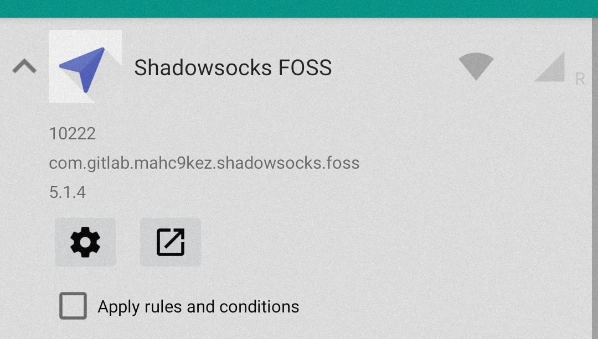
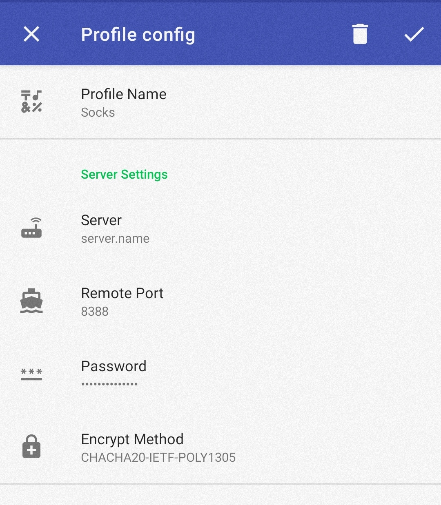

# Ansible — SOCKS Proxy using Shadowsocks

The Ansible playbook in this repository configures a SOCKS proxy for [NetGuard](https://www.netguard.me/). The server runs on [FreeBSD 13](https://www.freebsd.org/) and uses the [Shadowsocks](https://shadowsocks.org/en/index.html) package.

**Assumption:** The instance runs in Google Cloud using the Terraform script below,
- terraform__gcloud-instance
    - GitHub: [github.com/k3karthic/terraform__gcloud-instance](https://github.com/k3karthic/terraform__gcloud-instance)
    - Codeberg: [codeberg.org/k3karthic/terraform__gcloud-instance](https://codeberg.org/k3karthic/terraform__gcloud-instance)

## Code Mirrors

* GitHub: [github.com/k3karthic/ansible__shadowsocks](https://github.com/k3karthic/ansible__shadowsocks/)
* Codeberg: [codeberg.org/k3karthic/ansible__shadowsocks](https://codeberg.org/k3karthic/ansible__shadowsocks/)

## Requirements

Install the following before running the playbook,
```
$ ansible-galaxy collection install community.general
$ pip install google-auth requests
$ ansible-galaxy collection install google.cloud
```

## Dynamic Inventory

The Google [Ansible Inventory Plugin](https://docs.ansible.com/ansible/latest/collections/google/cloud/gcp_compute_inventory.html) populates public FreeBSD instances.

The target FreeBSD instance must have the label `shadowsocks_service: yes`.

## Configuration

1. Create `inventory/google.gcp_compute.yml` based on `inventory/google.gcp_compute.yml.sample`,
    1. Specify the project ID
    1. Specify the zone where you have deployed your server on Google Cloud
    1. Configure the authentication,
        1. Application Default Credentials (`auth_kind: application`)
            1. Import credentials from the Google Cloud Environment (e.g, Google Cloud Shell)
            2. Import credentials from Google Cloud SDK if installed 
        2. Service Account (`auth_kind: serviceaccount`)
            1. Use a service account for authentication. Refer [cloud.google.com/docs/authentication/production#create_service_account](https://cloud.google.com/docs/authentication/production#create_service_account).
            2. Set `service_account_file` to the credential file or `service_account_contents` to the json content
        3. Machine Account (`auth_kind: machineaccount`)
            1. When running on Compute Engine, use the service account attached to the instance
1. Set username and ssh authentication in `inventory/group_vars/all.yml`
1. Set the password in `files/config.json` using `files/config.json.sample`

## Deployment

Run the playbook using the following command,
```
$ ./bin/apply.sh
```

## Android Configuration

**Step 1.** Install [Shadowsocks FOSS](https://www.f-droid.org/en/packages/com.gitlab.mahc9kez.shadowsocks.foss/). Exempt it in [NetGuard](https://f-droid.org/en/packages/eu.faircode.netguard/) by de-selecting the “Apply rules and conditions” checkbox.



**Step 2.** Save the server configuration as a profile in Shadowsocks FOSS,
* *Server* — Instance hostname
* *Port* — 8388
* *Password* — Password set in `files/config.json`
* *Encrypt Method* — CHACHA20-IETF-POLY1305



## Encryption

Encrypt sensitive files (Shadowsocks config, SSH private keys) before saving them. `.gitignore` must contain the unencrypted file paths.

Use the following command to decrypt the files after cloning the repository,

```
$ ./bin/decrypt.sh
```

Use the following command after running terraform to update the encrypted files,

```
$ ./bin/encrypt.sh <gpg key id>
```
